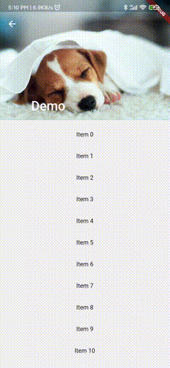

# GNestedScrollView

## 介绍

Flutter提供的NestedScrollView当body是PageView，且PageView里包含ListView时，滑动某一个Page里的ListView其他Page里的ListView也会
跟着滑动。

而且拉开头部时候也会有很多手势絮乱的问题。

## Flutter NestedScrollView的问题

下面提供一个NestedScrollView和PageView配合使用的例子：

```dart
// 一个NestedScrollView和PageView配合使用的例子
class TestNestedScrollView extends StatelessWidget {

  @override
  Widget build(BuildContext context) {

    Widget current = NestedScrollView(
        headerSliverBuilder: (BuildContext context, bool innerBoxIsScrolled){
          return [
            SliverAppBar(
              pinned: true, 
              expandedHeight: 250.0,
              flexibleSpace: FlexibleSpaceBar(
                title: const Text('Demo'),
                background: Image.asset(
                  "assets/images/dog.png",
                  fit: BoxFit.cover,
                ),
              ),
            ),
          ];
        },
        body: PageView(
          children: [
            TabChild(count: 30,),
            TabChild(count: 20,),
          ],
        ));

    current = Scaffold(
      body: current,
    );

    return current;
  }
}

class TabChild extends StatefulWidget {

  final int count;
  
  TabChild({this.count = 30});
  
  @override
  State<StatefulWidget> createState() {
    return _TabChildState();
  }
}

class _TabChildState extends State<TabChild> with AutomaticKeepAliveClientMixin {
  @override
  Widget build(BuildContext context) {
    super.build(context);
    return ListView.builder(
      padding: const EdgeInsets.all(8),
      itemCount: widget.count,
      itemBuilder: (BuildContext context, int index) {
        return SizedBox(
          height: 50,
          child: Center(child: Text('Item $index')),
        );
      },
    );
  }

  // @override
  bool get wantKeepAlive => true;
}
```
运行结果如下：


可以看到：
1.当滑动PageView其中一个Page的ListView时，另外Page里的ListView也会跟着滑动。
2.向下滑动的时，ListView并没有拉到顶部，Header部分也会被拉开。

## 使用gnested_scrollview的运行效果



可以看到当滑动ListView时，另外的ListView并没有出现联动，头部的拉出时机也没有出现问题。
